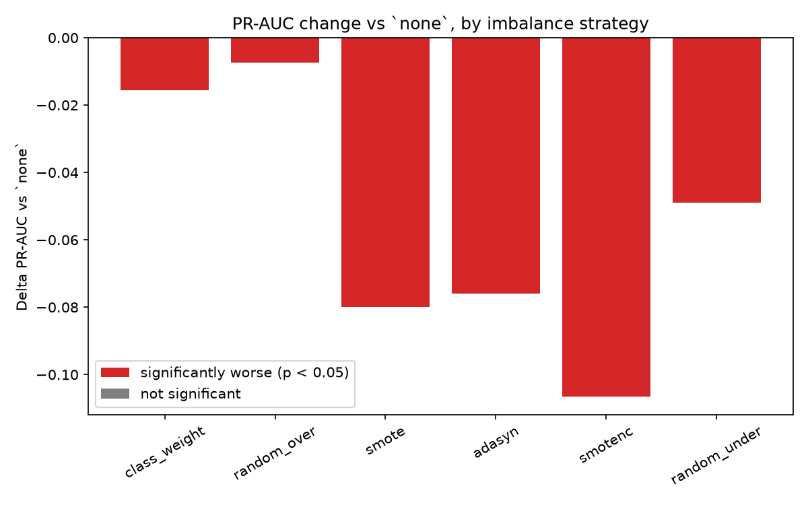
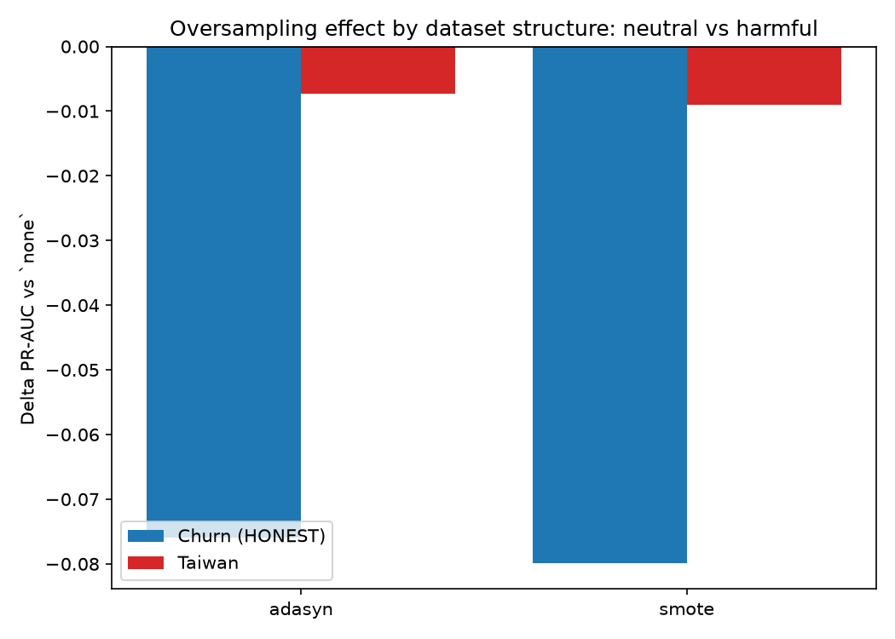
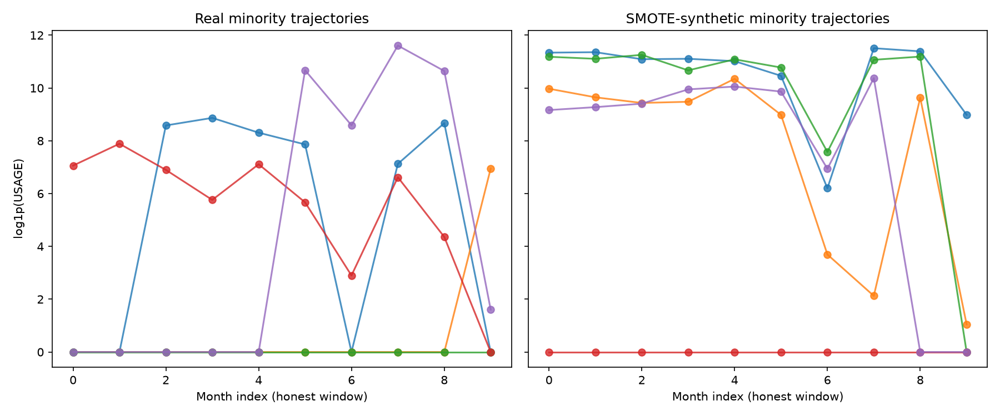

# Revisiting my old churn-prediction thesis, ten years and one honest audit later

*A write-up on leakage, honest resampling evaluation, and knowing when to stop believing a hypothesis you like.*

Ten years ago I wrote an undergraduate thesis on customer-churn prediction with imbalanced data. I got an A for it. My master's thesis in 2020 picked up the same dataset and the same family of methods and pushed further. This year I went back to both, not out of nostalgia, but because I wanted to see what my 2026 self would make of my 2016 work.

Short version: the way I evaluated imbalance handling back then inflated performance by around 55%. The oversampling methods I leaned on, SMOTE and ADASYN, never actually improved ranking; they were neutral on one dataset and actively harmful on the other. What I thought was an improvement from resampling turned out to be a shifted decision threshold that quietly wrecked probability calibration. I also had a theory for why oversampling specifically hurts panel data. I tested it properly, and it didn't survive. That last part is honestly the piece I'm most satisfied with.

Everything below comes from code in a public, reproducible repository, checked against an independent re-implementation. Where something surprised me, I tried to break it before trusting it.

*(The telecom dataset itself is proprietary and isn't shared here. The public half of this uses the open Taiwanese Bankruptcy Prediction dataset from Liang et al., 2016, hosted on UCI; all code for that half is open.)*

---

## Most of the "performance" was measuring the churn event itself

The dataset is a monthly panel: twelve months of billing, payment status, complaints, and usage per customer, with a churn label attached to the final month, `N`.

The first question I asked was whether the features actually predicted churn, or just recorded it happening. Mostly the latter. At month `N`, 57.8% of churners already show zero usage, against 3.0% of non-churners, because by that point the customer is already being disconnected. That's not a leading indicator; it's the event itself sitting in the feature table.

So I compared models trained on different windows of the same panel, holding everything else fixed:

| Window | PR-AUC | Recall @ top-10% |
|---|---|---|
| All 12 months (what I did originally) | 0.83 | 0.93 |
| Honest window (`N-11` to `N-2`, dropping the contaminated months) | 0.38 | 0.51 |

The first row says you'd catch 93% of churners. The honest number is 51%. About 55% of that apparent PR-AUC was leakage, and a permutation-importance check confirmed the leaky model was leaning almost entirely on the two contaminated final-month columns.

This wasn't a mistake unique to me. Pre-split resampling, artificially balanced test sets, and accuracy as the headline metric were standard practice across a whole generation of applied ML theses, mine included. On the Taiwan bankruptcy data, running SMOTE across the entire dataset before cross-validation, the most extreme version of this mistake, produces a PR-AUC of 1.000. Perfect, and meaningless.

---

## The oversampling both my theses were built around didn't actually help

Both theses treated imbalance-handling-via-sampling as the main event. So this time I ran the comparison I never ran properly back then: every strategy evaluated under a leakage-safe protocol (resampling fit strictly inside each training fold), repeated stratified k-fold, judged on PR-AUC, recall-at-budget, and calibration, not accuracy.

On the churn panel, using the honest window:

| Strategy | PR-AUC (mean ± sd) |
|---|---|
| No handling | 0.37 ± 0.02 |
| Random oversampling (duplication) | 0.36 ± 0.02 |
| SMOTE | 0.29 ± 0.03 |
| ADASYN | 0.29 ± 0.02 |
| SMOTENC | 0.26 ± 0.02 |

Every synthetic oversampler did significantly worse than doing nothing at all (paired Wilcoxon, p ≈ 0.002, harmful in every fold). Plain duplication, at least, was harmless.

I then reran the same comparison on the public Taiwan data, which is cross-sectional rather than a time panel, and there SMOTE and ADASYN were statistically indistinguishable from doing nothing (p ≈ 0.28).

Put together: synthetic oversampling ranged from neutral on cross-sectional data to harmful on the temporal panel, and was never once helpful in either. The "SMOTE improved my results" claim I made in my own thesis was most likely an artifact of leakage combined with accuracy as the scoring metric.

---

## Why it looked like it was working: it just moves the threshold, and wrecks calibration

If oversampling doesn't improve ranking, why did it feel like it worked at the time? At a fixed 0.5 threshold, the no-handling model catches few positives (recall 0.21) at high precision (0.83). Resampling pushes recall up to 0.62, but only by giving up precision. The model underneath hasn't gotten better; the same ranking is just being read off at a different cutoff, which you could get directly without synthesizing anything.

There's also a cost that doesn't show up if you only look at recall: resampling badly damages probability calibration. Brier score goes from 0.029 with no handling to 0.14 with class weighting, roughly five times worse. If decisions are made on expected value, which is how retention economics usually works, a miscalibrated probability is a real problem hiding behind a recall number that looks better than it is.

---

## Chasing an explanation, and losing it

At this point it would have been easy to stop and write a tidy story. I had a hypothesis I liked: SMOTE interpolates between different customers' time series, so it should produce jagged, temporally incoherent synthetic trajectories, and that's presumably why it hurts on panel data specifically.

I tested it, and it was wrong, in the wrong direction. My roughness metric said SMOTE sequences were smoother than real ones, not rougher. In hindsight that's obvious: averaging two curves smooths them out. I'd picked a metric the mechanism itself defeats mechanically.

So I switched to a different tool: a classifier two-sample test, training a model to tell real churners apart from SMOTE-synthetic ones. If they're truly indistinguishable, AUC should sit around 0.5. I got 0.86. Synthetic customers are strongly detectable; they are unrealistic, just not in a way that shows up in per-signal temporal shape. The unrealism seems to live in the joint structure across features, dominated by billing variables, consistent with off-manifold interpolation.

That felt like a real mechanism, until I asked whether it actually explains the neutral-vs-harmful split. I ran the same detectability test on Taiwan, carefully controlling for sample size and feature count, since both inflate detectability on their own. Once controlled, churn and financial synthetics turned out about equally detectable (around 0.61 each, overlapping intervals). Off-manifold synthesis happens in both domains, but only hurts ranking in one. Detectability alone can't explain the demarcation either.

That's two hypotheses now that didn't hold up once I actually tested them. The effect itself is real and holds up under scrutiny; what's causing it is still genuinely open.

---

## What I'd stand behind, and what I wouldn't

Well-supported, cross-checked and significance-tested:
- Pre-split resampling and contaminated-window features inflate measured performance substantially, about 55% here, and up to a perfect 1.000 in the worst public-data case.
- Synthetic oversampling didn't improve ranking in either dataset; it ranged from neutral to harmful.
- Resampling shifts the operating threshold and degrades calibration.

Deliberately limited claims:
- The neutral-vs-harmful split rests on two datasets. Calling it "temporal structure" is a hypothesis I find plausible, not something I've proven.
- The mechanism is unresolved. Temporal incoherence didn't hold up; off-manifold detectability is real but doesn't explain the split on its own.

I'd rather stand behind a smaller claim that survives scrutiny than a bigger one that doesn't.

---

## Why this is worth writing up

Not because SMOTE is bad; that would just be a different overclaim. It's because how imbalance handling gets evaluated routinely manufactures conclusions that don't survive an honest protocol. The fix isn't exotic: resample inside the fold, evaluate on the real distribution, report PR-AUC and calibration instead of accuracy, and pick your operating threshold on purpose instead of by accident.

The open question, why off-manifold synthetic points corrupt ranking on some data structures and not others, and whether structure-aware generative methods can do better, is something I want to keep working on. It's a better question than the one I started with, and I only have it because two hypotheses I liked didn't survive contact with the data.

Ten years ago I evaluated a model on an artificially balanced test set and reported 95% accuracy. Finding that embarrassing now is, if nothing else, a sign I've learned something in the meantime.

---

*Code and reproducible experiments: https://github.com/aldolionel/thesis-recreation-2026. Each experiment writes a verification report with dataset fingerprints and self-run acceptance checks; every figure regenerates from the pipeline, and a full run drift-checks every headline number against the committed values.*
